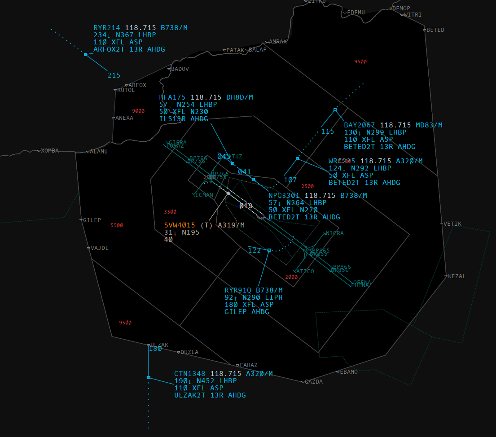
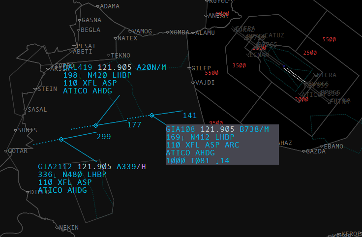
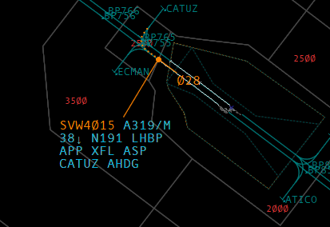
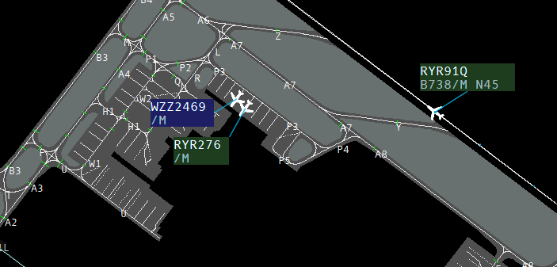

# LHCC Sectorfile for IVAO Aurora
* Previous contributors (2022-24~): Janos V (327013), Keve K (492790)
* Current contributors (2025-26): Andras Hevesy (645592), Istvan E (338686)

Possible problems with LHBP.GTS. 
Sometimes Aurora can't load gate slots and sectorfile loading fails. You can press F1 and load the sectorfile again. 
Just IVAO software things:)

## Screenshots
### Budapest Ground Layer

### Budapest TMA

### Tags
It's in the profile file: LHBP_APP.cpr
#### Airborne traffic

#### Ground traffic
Details depends on SQK mode! Aircraft type and speed only available when sqk is on.
