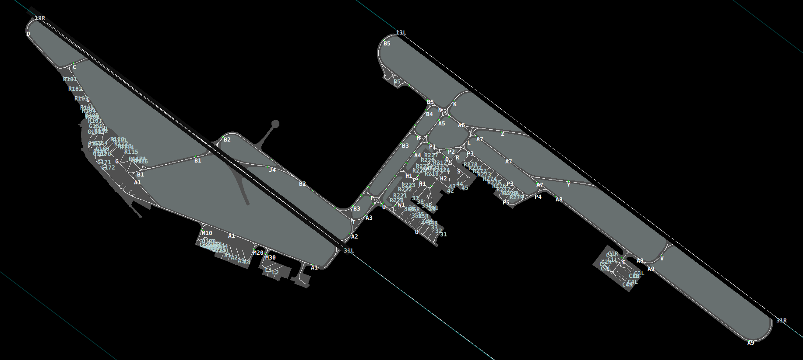
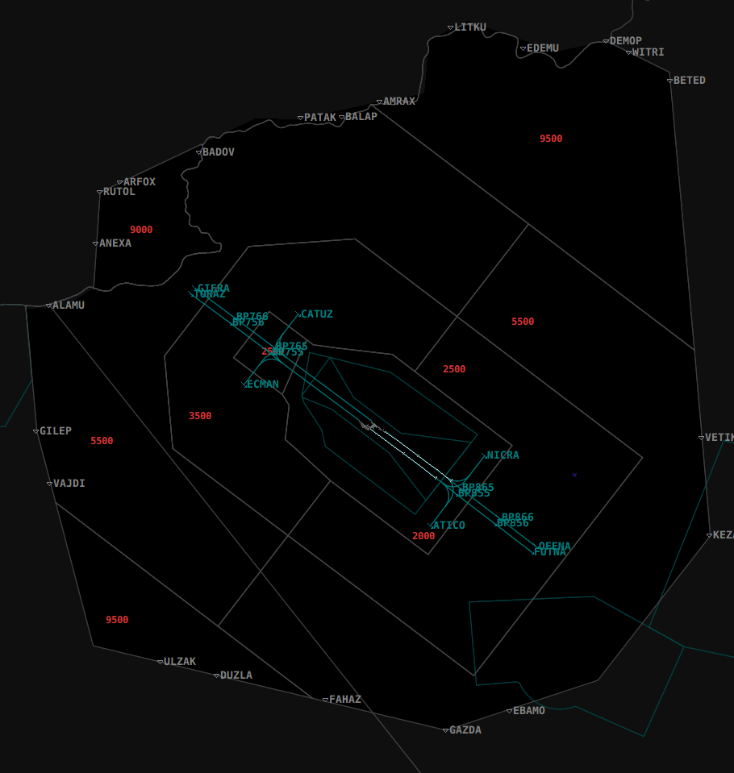
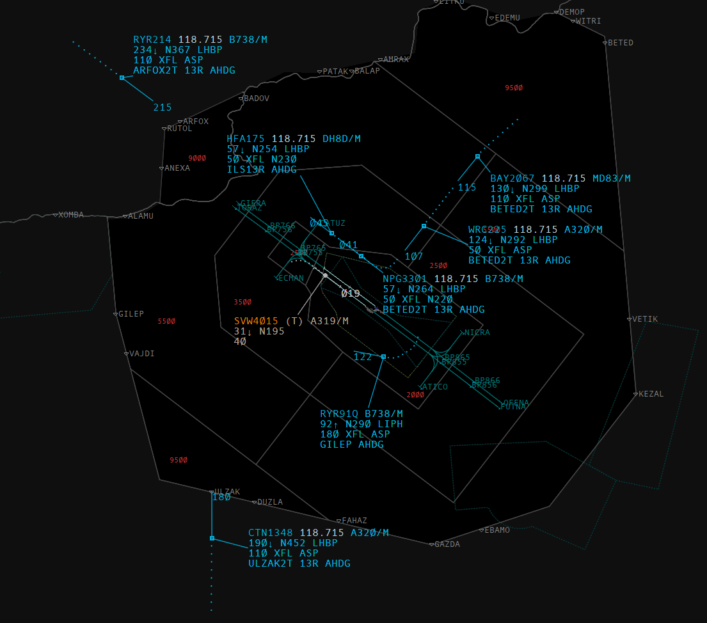
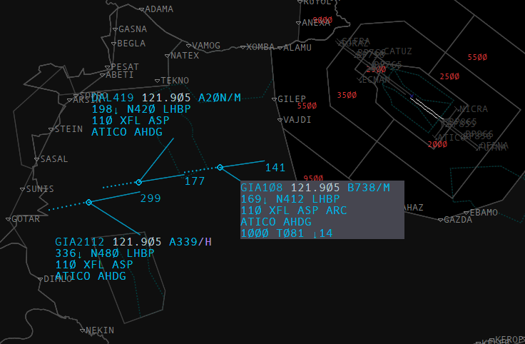
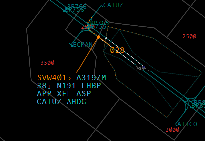
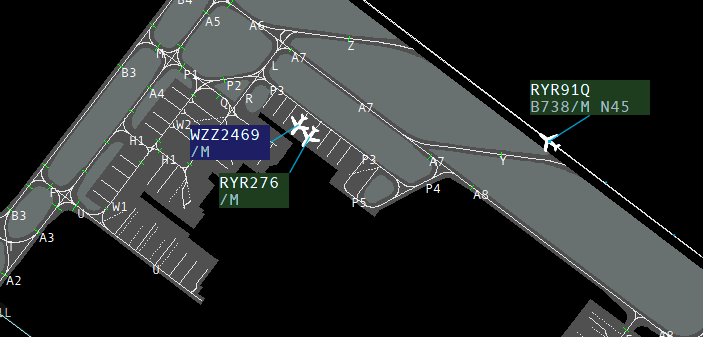

# LHCC Sectorfile for IVAO Aurora
* Previous contributors (2022-24~): Janos V (327013), Keve K (492790)
* Current contributors (2025-26): Andras Hevesy (645592), Istvan E (338686)

Possible problems with LHBP.GTS. 
Sometimes Aurora can't load gate slots and sectorfile loading fails. You can press F1 and load the sectorfile again. 
Just IVAO software things:)

## Installation
1. Download the complete zip version from the Main Branch.
2. Extract directly (or copy) and _**OVERWRITE**_ to the SectorFiles folder within your Aurora Installation folder
    * **Windows:**\
      `<Aurora_Root_folder>\SectorFiles`\
      by default:\
      `C:\Aurora\SectorFiles`\
      Your other downloaded sectorfiles will remain intact.
3. Optional: Move the profile file (contains the tags) from Include/HU/PREFS folder to Aurora/Profiles

## Screenshots
### Budapest Ground Layer

### Budapest TMA

### Tags
It's in the profile file: LHBP_APP.cpr
#### Airborne traffic

#### Ground traffic
Details depends on SQK mode! Aircraft type and speed only available when sqk is on.
